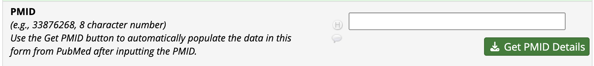
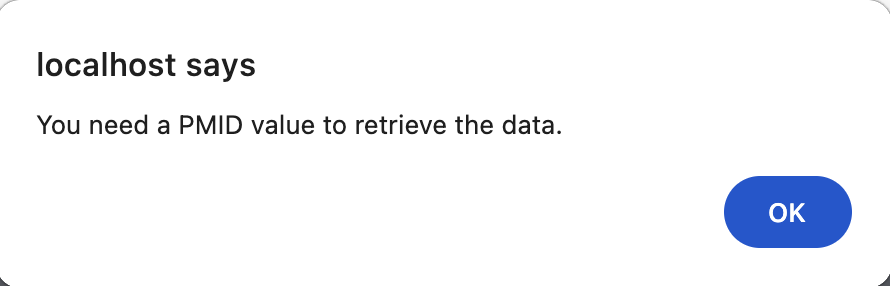
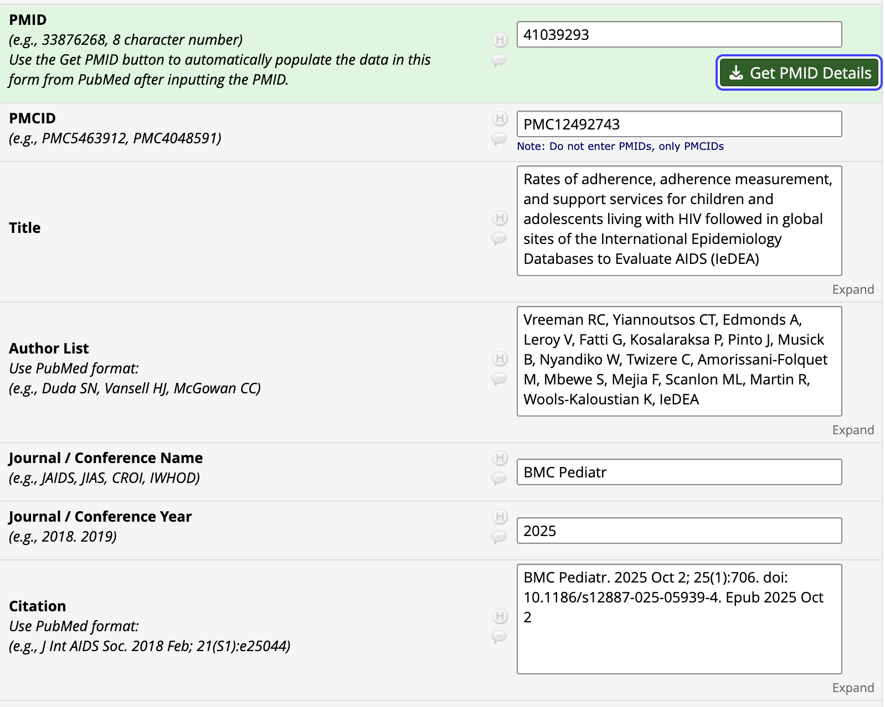

# Get PMID Details

A REDCap External Module that automatically retrieves journal article details from PubMed based on a user-entered PMID (PubMed ID).

## Description

This module adds a **"Get PMID Details"** button to a REDCap instrument (data entry form or survey). When a user enters a PMID and clicks the button, the module queries the NCBI PubMed API and auto-fills the following fields:

| Field Name | Description |
|---|---|
| `output_pmid` | The PubMed ID entered by the user |
| `output_title` | Article title |
| `output_authors` | Comma-separated list of authors |
| `output_year` | Publication year |
| `output_venue` | Journal/source name |
| `output_citation` | Full formatted citation |
| `output_pmcid` | PubMed Central ID (if available) |
| `output_url` | Direct link to the PubMed article |

The instrument is also automatically marked as **Complete** upon successful retrieval.

## Installation

1. Download or clone this module into your REDCap `modules/` directory.
2. Enable the module at the system level via **Control Center > External Modules**.
3. Enable the module in your project via **Project Setup > External Modules**.

## Configuration

After enabling the module in your project, configure the following settings:

| Setting | Required | Description |
|---|---|---|
| **Instrument Name** | Yes | The unique name of the instrument where the PMID lookup should appear (e.g., `publication_details`) |
| **API Key** | No | An NCBI API key for higher request limits. [Get one here](https://ncbiinsights.ncbi.nlm.nih.gov/2017/11/02/new-api-keys-for-the-e-utilities/) |

## Instrument Setup

Your instrument must contain text fields with the following variable names for the module to populate them:

- `output_pmid`
- `output_title`
- `output_authors`
- `output_year`
- `output_venue`
- `output_citation`
- `output_pmcid`
- `output_url`

> **Tip:** You can use the Online Designer or a data dictionary CSV to create these fields.

## Usage

1. Navigate to the configured instrument on a data entry form or survey.
2. Enter a valid PMID in the `output_pmid` field.
3. Click the **"Get PMID Details"** button that appears below the field.
4. The module will fetch and auto-fill the article details.

If the PMID is empty, an error message will be displayed below the button.

Example of an auto-filled PMID.

